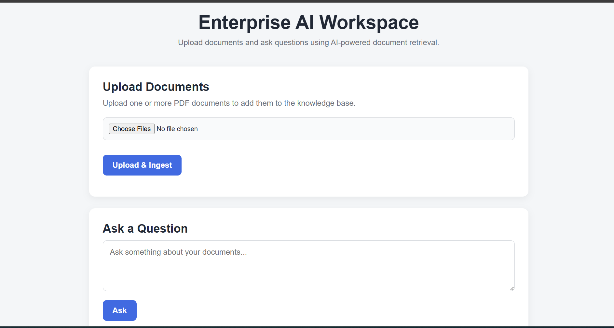
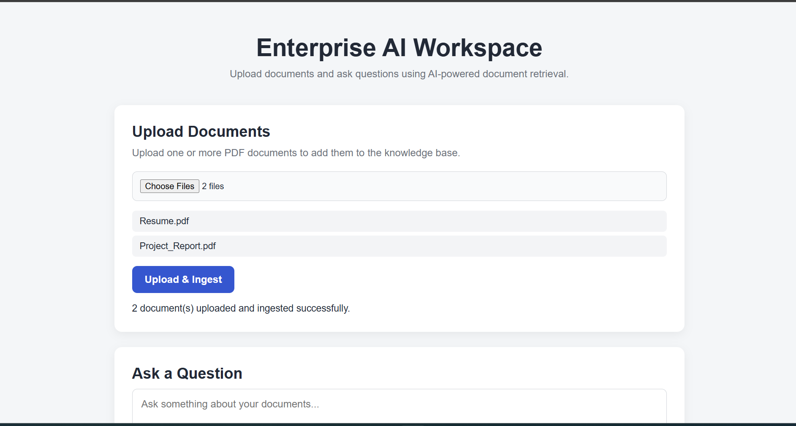
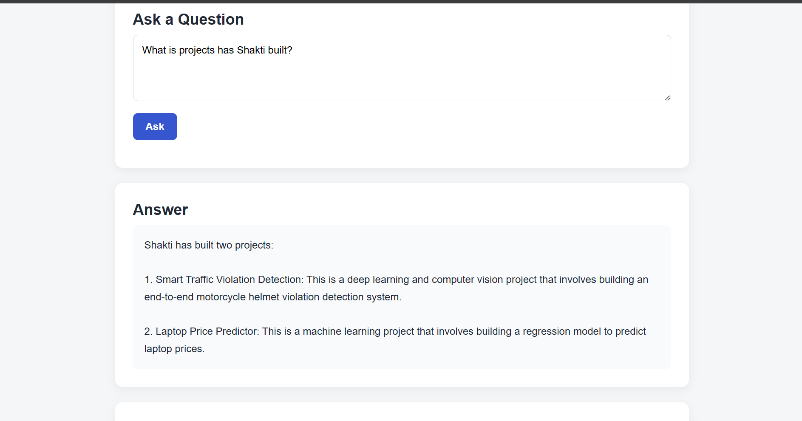
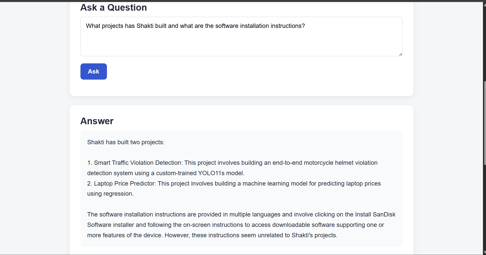
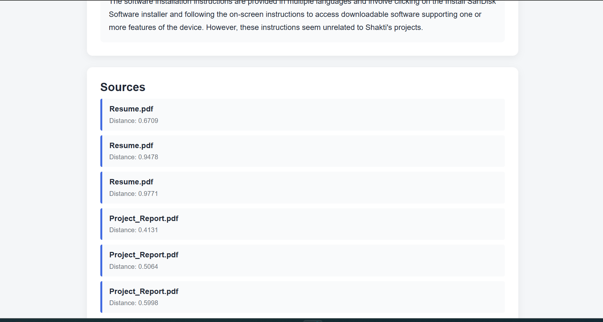
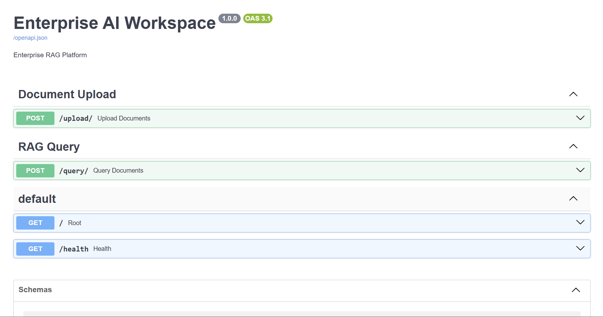

# 🤖 Enterprise AI Workspace

> **An end-to-end multi-document Retrieval-Augmented Generation (RAG) platform built with FastAPI, ChromaDB, Hugging Face embeddings, Groq, Docker, and a lightweight web frontend.**

---

## 📑 Table of Contents

- [Overview](#-overview)
- [Project Highlights](#-project-highlights)
- [Live Demo](#-live-demo)
- [Features](#-features)
- [Screenshots](#-screenshots)
- [Architecture](#-architecture)
- [RAG Pipeline](#-rag-pipeline)
- [Tech Stack](#-tech-stack)
- [Project Structure](#-project-structure)
- [Installation](#-installation)
- [Run Locally](#-run-locally)
- [Run with Docker](#-run-with-docker)
- [API Endpoints](#-api-endpoints)
- [Example Queries](#-example-queries)
- [Deployment](#-deployment)
- [Current Capabilities](#-current-capabilities)
- [Future Roadmap](#-future-roadmap)
- [Author](#-author)
- [License](#-license)

---

## 📌 Overview

Enterprise AI Workspace is an end-to-end **Retrieval-Augmented Generation (RAG)** platform that allows users to upload multiple PDF documents and ask natural-language questions across their combined knowledge base.

The system processes uploaded documents through a complete ingestion pipeline:

**Document Upload → Text Extraction → Cleaning → Chunking → Embeddings → ChromaDB**

When a user asks a question, the system performs:

**Query Embedding → Semantic Retrieval → Context Construction → LLM Generation → Answer + Sources**

The platform supports **multi-document retrieval**, allowing information from different uploaded documents to be combined when answering a single query.

---

## ⭐ Project Highlights

- End-to-end multi-document RAG pipeline
- Multiple PDF upload and ingestion
- Semantic vector search using ChromaDB
- Hugging Face BGE embeddings
- Query decomposition for multi-part questions
- LLM-powered answer generation using Groq
- Source attribution with retrieved document metadata
- Persistent document and vector storage
- FastAPI backend
- Lightweight web frontend
- Dockerized backend and frontend
- Docker Compose orchestration
- CORS-enabled frontend/backend communication
- Interactive API documentation through Swagger UI

---

## 🌐 Live Demo

🚀 **Try the application here**

👉 **[Launch Enterprise AI Workspace](LIVE_DEMO_URL)**

> **Note**
>
> The hosted application is intended primarily as a demonstration environment.
> Depending on the hosting platform and instance inactivity, the first request may take some time while the service starts.

---

## ✨ Features

### 📄 Multi-Document Upload

Upload multiple PDF documents through the web interface.

Each document receives a unique document ID and is processed independently through the ingestion pipeline.

### 🧹 Document Processing

Uploaded documents go through:

- Text extraction
- Text cleaning
- Recursive chunking
- Embedding generation

### 🧠 Semantic Search

Questions are converted into embeddings and searched against document embeddings stored in ChromaDB.

### 📚 Cross-Document Question Answering

The system can retrieve information from multiple documents for a single query.

For example:

> What projects has Shakti built and what are the software installation instructions?

The system can retrieve the relevant information from both documents and generate a combined answer.

### 🧩 Query Decomposition

Complex queries containing multiple independent information requests can be decomposed into standalone questions before retrieval.

### 🤖 LLM Generation

Retrieved document chunks are provided as context to a Groq-hosted LLM which generates the final answer.

### 🔎 Source Attribution

Responses include the retrieved document sources, including:

- Document filename
- Chunk ID
- Retrieval distance

### 💾 Persistent Storage

Uploaded documents and ChromaDB data are stored using persistent Docker volumes.

### 🐳 Dockerized Architecture

Both the FastAPI backend and frontend are containerized and orchestrated using Docker Compose.

---

## 🖼️ Screenshots

### 🏠 Home / Document Upload

The web interface allows users to upload one or more PDF documents and query the resulting knowledge base.



---

### 📄 Multiple Document Upload

Multiple documents can be uploaded and ingested into the same knowledge base.



---

### 💬 Question Answering

Users can ask natural-language questions against the uploaded documents.



---

### 📚 Cross-Document Question Answering

The system can combine information retrieved from multiple documents to answer a single question.

For example:

> **What projects has Shakti built and what are the software installation instructions?**

The system retrieves the relevant information from the appropriate documents and generates a combined answer.





---

### 🔎 Source Attribution

Each generated response includes the document chunks used during retrieval, along with their similarity distances and source filenames.

This provides visibility into **which documents contributed to the generated answer**.


---

### 📖 API Documentation

The backend exposes an interactive Swagger UI through FastAPI.



---

## 🏗️ Architecture

```text
                         ┌─────────────────────┐
                         │       Browser       │
                         │     Web Frontend    │
                         └──────────┬──────────┘
                                    │
                                    ▼
                         ┌─────────────────────┐
                         │       Nginx         │
                         │    Frontend :3000   │
                         └──────────┬──────────┘
                                    │
                                    ▼
                         ┌─────────────────────┐
                         │       FastAPI       │
                         │     Backend :8000   │
                         └──────────┬──────────┘
                                    │
                 ┌──────────────────┼──────────────────┐
                 │                  │                  │
                 ▼                  ▼                  ▼
          Document Pipeline      Retrieval         Generation
                 │                  │                  │
                 ▼                  ▼                  ▼
          Text Extraction      Query Embedding      Groq LLM
                 │                  │
                 ▼                  ▼
          Text Cleaning         ChromaDB
                 │                  │
                 ▼                  │
             Chunking             │
                 │                  │
                 ▼                  │
             Embeddings ───────────┘